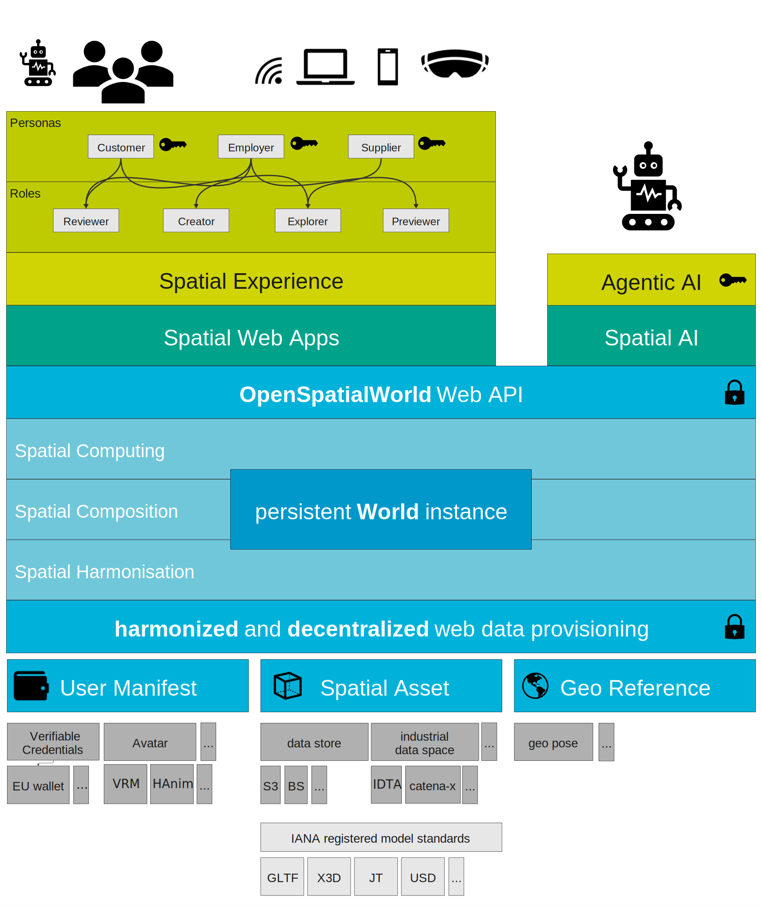

# initial_MSF_Whitepaper

Permanent Home of the initial MSF white paper

[Link to pdf version](https://webofworlds.github.io/initial_MSF_Whitepaper/gen/MSF-3DWebInterop_WoWWhitepaper.pdf)

🌐 Web of Worlds (WoW) — Executive Summary

An open, decentralized and efficient architecture for the metaverse built on web standards.

⸻

📌 Overview

The Web of Worlds (WoW) proposes a new model for the metaverse:
a network of interconnected 3D experiences, similar to how websites form today’s web.

Instead of isolated platforms, WoW enables:
* 🌍 Seamless movement between virtual worlds
* 🔗 Standardized linking of 3D experiences
* 👤 Portable user identity and assets

⸻

🚀 Vision

WoW extends the Open Web Platform (OWP) principles into 3D and immersive environments:
* 🌐 Universality — Accessible on any device
* 🧩 Interoperability — Consistent cross-platform experiences
* 🛡️ Decentralization — No central authority
* ♿ Accessibility — Inclusive by design

⸻

🧱 Core Concepts

🔗 Linked Spatial Experiences
* Worlds are addressable via URIs (like web pages)
* Navigation through portals and links
* Forms a network of connected virtual environments

⸻

📦 Shared Spatial Assets
* Modular, reusable 3D components
* Built on existing standards (e.g. gltf, x3d, usd )
* Delivered via standard web infrastructure

⸻

👤 Shared User Manifest (“Digital YOU”)

A portable, user-controlled identity layer:

Includes:
* Avatar & identity
* Preferences & settings
* Assets (wearables, credentials, NFTs)

Powered by:
* 🔐 Decentralized Identifiers (DIDs)
* 🧾 Verifiable Credentials
* 🪪 Digital wallets

⸻

🕸️ Decentralized Architecture
* No platform lock-in
* User-owned data
* Distributed storage and identity

⸻

🤖 AI Integration
* AI agents operate alongside humans
* Enables:
* Automation
* Spatial reasoning
* Human–AI collaboration

⸻

🏗️ Architecture

WoW introduces a lightweight WoW Architecture and API that connects existing web technologies:
* 🌐 Browser-based delivery (no installs)
* 🧩 Dynamic composition of worlds and assets
* 🔗 Linking of worlds, assets and user manifest
* ⚙️ Built on technologies like:
  * WebGL / WebGPU
  * JSON-LD
  * DID

⸻

✅ Key Benefits
* 🔄 Interoperability — Move across worlds seamlessly
* 👤 User Ownership — Control identity and data
* 📈 Scalability — Built on web infrastructure
* 🧠 Flexibility — Supports many industries
* ⚡ Efficiency — Reduces complexity vs current solutions

⸻

🎯 Use Cases
* 🧑‍💼 Virtual collaboration & meetings
* 🏭 Industrial digital twins
* 🎓 Education & virtual field trips
* 🎮 Gaming & entertainment
* 🌍 Cross-platform social experiences

⸻

🔮 Conclusion

The Web of Worlds aims to evolve the metaverse into an open, interconnected ecosystem, much like the internet itself.

By leveraging existing standards and introducing minimal new abstractions, WoW provides a practical path toward a scalable, interoperable, and user-centric metaverse.

